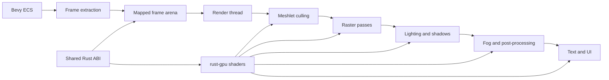

# Asha

Asha is my experimental renderer for Vulkan 1.3. Bevy provides the application
framework and ECS. Asha owns rendering through my [`gpu`](https://tangled.org/git.gorto.xyz/gpu)
interface and uses rust-gpu for shaders.

The renderer focuses on GPU-driven geometry, stylized lighting, and explicit frame
ownership. It does not use wgpu or Bevy's rendering stack.




*The light lab uses the exact ray-traced shadow path with three moving point lights.*

## Features

- GPU-driven meshlet culling and indirect drawing
- Exact ray-traced and budgeted temporal local shadows
- Volumetric fog, particles, bloom, outlines, and transmission
- Stylized mesh shading, silhouettes, and linework
- GPU-rendered Bevy UI, text, gradients, shadows, and widgets
- Shared host and shader ABI types with typed device addresses
- Three frame arenas gated by Vulkan timeline semaphores

## Run the light lab

Asha requires a Vulkan 1.3 device with the extensions listed in the
[`gpu` requirements](https://tangled.org/git.gorto.xyz/gpu#vulkan-requirements).
The shader build uses the pinned nightly toolchain from `shaders/rust-toolchain.toml`.

```sh
git clone https://github.com/cgorto/asha.git
cd asha/shaders
cargo run -p builder --release
cd ..
LAB_EXACT=1 LAB_SCENARIO=all LAB_LIGHTS=3 cargo run --release -p render --example light_lab
```

Run the automated checks with:

```sh
cargo fmt --all -- --check
cargo check --workspace --all-targets
cargo test --workspace --all-targets
```

The renderer tests require a compatible Vulkan device. Some UI tests also require
a window-system connection.

## Repository map

```text
crates/abi          Shared host and shader data types
crates/render       Bevy extraction and render-thread integration
crates/mesh         Mesh storage, meshlets, drawing, and ray queries
crates/post         Fog and display-space effects
crates/particles    Particle simulation and rendering
crates/text         GPU text encoding and rendering
crates/ui           GPU UI passes
crates/ui-bridge    Bevy UI extraction
crates/widgets      Bevy widget set and renderer integration
shaders             rust-gpu shaders and SPIR-V builder
```

Read [`docs/shader-groups.md`](docs/shader-groups.md) for the material batching and
shader-group architecture.

## License

Licensed under either of the following, at your option:

- [Apache License, Version 2.0](LICENSE-APACHE)
- [MIT License](LICENSE-MIT)
